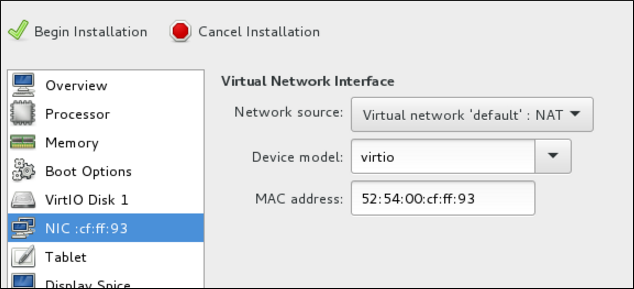

## Creating a custom RHEL 7.7+ Server image on Google Cloud Platform

In this section we'll use the Centos 7 Workstation created in the previous guide [Installing / Configuring GNOME and VNC Server](https://github.com/chainlynx/google-cloud-centos-workstation/blob/master/Installing-Configuring-GNOME.md) to setup a custom RHEL 7.7+ image that can then be used in setting up the nodes for your Openshift Enterprise cluster. 

Google Cloud Platform also provides a default RHEL 7 image, in the available images when creating an instance, however this instance also includes a usage fee of about $43.80/month. Basically this image already comes with a Red Hat subscription and therefore use of this image, even if you update it with your own subscription, is subject to this fee. More information [here](https://console.cloud.google.com/marketplace/details/rhel-cloud/rhel-7).

Therefore, this guide is aimed at creating a custom image, adding support for the Google Cloud Platform, and running an instance of RHEL 7 without incurring this additional fee.

#### Prerequisites

- You must belong to an active GCP project, and have sufficient privaledges to create resources in the project.

- To proceed with this guide, you will need a Red Hat subscription, with the ability to access the base images [here](https://access.redhat.com/downloads/content/69/ver=/rhel---7/7.7/x86_64/product-software) 

- **Note:** I also have a RHEL 7.7 image created that can be shared, to avoid building one yourself, and saving you a few steps, however it still requires activation with your subscription on each node you create with the image.

- Your project should have a [service account](https://cloud.google.com/iam/docs/understanding-service-accounts). A service account is a special type of Google account that belongs to a VM instance, not an individual user. This creates a single source that can authorize API call permissions from all instances instead of having to manage authorization for individual user accounts. See [Using the Compute Engine Default Service Account](https://cloud.google.com/compute/docs/access/create-enable-service-accounts-for-instances#using_the_compute_engine_default_service_account) for information about using the default service account instead of creating a separate service account.
  
  If you or your project administrator create a custom service account, the service account should be configured for the following roles.
  
  - Cloud Trace Agent
  - Compute Admin
  - Compute Network Admin
  - Cloud Datastore User
  - Logging Admin
  - Monitoring Editor
  - Monitoring Metric Writer
  - Monitoring Metric Writer
  - Storage Admin

### Getting Started

Complete the following steps to create the base RHEL 7.7 VM image for GCP. Complete this procedure using a RHEL 7 Server, Centos 7 Server, or Fedora. For the purpose of this guide, we'll use the Centos 7 workstation created in the previous steps: [Installing / Configuring GNOME and VNC Server](https://github.com/chainlynx/google-cloud-centos-workstation/blob/master/Installing-Configuring-GNOME.md).

##### Before you Start

You need the following packages installed on your Centos 7 workstation to create an configure the RHEL 7.7 VM image.

<table>
  <tr bgcolor="#cccccc">
    <th align="left">Package</th>
    <th align="left">Repository</th>
    <th align="left">Description</th>
  </tr>
  <tr>
    <td nowrap="true">libvirt</td>
    <td nowrap="true">rhel-7-server-rpms</td>
    <td>Open source API, daemon, and management tool for managing platform virtualization</td>
  </tr>
  <tr>
    <td nowrap="true">virt-manager</td>
    <td nowrap="true">rhel-7-server-rpms</td>
    <td>A command line and Gnome desktop virtual machine manager used to create and manage KVM virtual machines</td>
  </tr>
  <tr>
    <td nowrap="true">libguestfs</td>
    <td nowrap="true">rhel-7-server-rpms</td>
    <td>A library for accessing and modifying virtual machine file systems</td>
  </tr>
  <tr>
    <td nowrap="true">libguestfs-tools</td>
    <td nowrap="true">rhel-7-server-rpms</td>
    <td>System administration tools for virtual machines; includes the guestfish utility</td>
  </tr>
</table>

##### Install and configure the Google Cloud SDK

Most examples in this guide use [gcloud](https://cloud.google.com/sdk/gcloud/) and [gsutil](https://cloud.google.com/storage/docs/gsutil) to manage RHEL resources in GCP. You install the Google Cloud SDK on your workstation to get these utilities. For information about how to install and configure the Google Cloud SDK, see the [Quickstart for Red Hat and Centos](https://cloud.google.com/sdk/docs/quickstart-redhat-centos).

**Note**: You can also use the [GCP Console](https://console.cloud.google.com/) or [API requests](https://cloud.google.com/compute/docs/api/getting-started) to manage resources in GCP. Using the API also requires the Google Cloud SDK.

##### Create a GCP image bucket

You use the GCP storage utility (gsutil) to create a bucket where you store your images. Enter the following command to create a bucket for your image(s).

The following command includes the minimum requirements for creating a [multi-regional](https://cloud.google.com/storage/docs/storage-classes#multi-regional) bucket in your default location. See [Creating Storage Buckets](https://cloud.google.com/storage/docs/gsutil/commands/mb) for additional options and bucket-naming requirements.

```
$ gsutil mb gs://<BucketName>
```
Example:
```
$ gsutil mb gs://rhel-77-bucket/
```

#### Next Steps

1. Download the latest 7.7 (or later) version of [Red Hat Enterprise Linux](https://access.redhat.com/downloads/content/69/ver=/rhel---7/7.7/x86_64/product-software) from the Red Hat Customer Portal. You should download the **Red Hat Enterprise Linux KVM Guest Image***.
2. Move the image to ```/var/lib/libvirt/images```
3. Create a new VM using ```virt-manager```. Note the following when creating the VM.
   - **Import an existing disk image** and select the downloaded qcow2 file.
   - Accept or change the memory and CPU settings to your application requirements.
   - Select the **Customize configuration before install** check box.
   - On the custom configuration dialog box, make sure that **virtio** is set as the NIC Device model, and then begin the installation.
   - The VM may hang momentarily at the ```IPV6 eth0``` line when booting up. This is normal at this point in the installation.
   - 
   - For detailed virt-manager instructions, see [Create the RHEL VM from a RHEL KVM Guest Image](https://access.redhat.com/articles/uploading-rhel-image-to-azure#header11)
4. Shut down the VM when you see the login prompt.
5. From your RHEL system, set up root access to the VM. Use virt-customize to generate a root password for the VM. Make sure to create a strong password.
   ```
   # virt-customize -a <guest-image-path> --root-password password:<password>
   ```
   Example:
   ```
   # virt-customize -a /var/lib/libvirt/images/rhel-server-7.7-x86_64-kvm.qcow2 --root-password password:<password>
   [   0.0] Examining the guest ...
   [ 103.0] Setting a random seed
   [ 103.0] Setting passwords
   [ 112.0] Finishing off
   ```
6. Verify root access by starting the VM and logging in as root.
7. Verify that ```python-boto``` and ```cloud-init``` are installed on the VM.
   - [python-boto](https://github.com/boto/boto) is required for Red Hat Cloud Access RHEL VMs on GCP. This package is installed on the **Red Hat Enterprise Linux KVM Guest Image**. If ```python-boto``` is not installed on a custom image, enable the ```rhel-7-rh-common-rpms``` repository and install it.
   - ```cloud-init``` handles cloud provisioning and is also installed on the KVM Guest image. If you need to install it, the package is available in ```rhel-7-server-rpms```.
   ```
   # rpm -qa | grep python-boto
   # rpm -qa | grep cloud-init
   ```
8. Temporarily enable root password access. Edit ```/etc/cloud/cloud.cfg``` and update ```ssh_pwauth``` from **0** to **1**.
   ```
   ssh_pwauth: 1
   ```

#### Prepare and Import the base GCP image

Complete the following steps to prepare the image for GCP

1. Enter the following command to convert the file. Images uploaded to GCP need to be in raw format and named **disk.raw**.
   ```
   $ qemu-img convert -f qcow2 <ImageName>.qcow2 -O raw disk.raw
   ```
2. Enter the following command to compress the raw file. Images uploaded to GCP need to be compressed.
   ```
   $ tar -Sczf <ImageName>.tar.gz disk.raw
   ```
3. Import the compressed image to the bucket created earlier.
   ```
   $ gsutil cp <ImageName>.tar.gz gs://<BucketName>/
   ```

#### Create and configure a base GCP instance

Complete the following steps to create and configure an instance so it complies with GCP operating and security requirements for running instances.

1. Enter the following command to create an image from the compressed file in the bucket.
   ```
   $ gcloud compute images create <BaseImageName> --source-uri gs://<BucketName>/<BaseImageName>.tar.gz
   ```
   Example:
   ```
   $ gcloud compute images create rhel-76-server --source-uri gs://user-rhel77/rhel-server-77.tar.gz
   Created [https://www.googleapis.com/compute/v1/projects/MyProject/global/images/rhel-server-77].
   NAME            PROJECT                 FAMILY  DEPRECATED  STATUS
   rhel-77-server  rhel-77-server-testing                      READY
   ```
2. Enter the following command to create a template instance from the image. Note that these are the basic command options to create a RHEL HA instance attached to a service account. See [Before you start]() for more information about the service account.
   
   **Notes:**
   - ```--machine-type n1-standard-2``` is the minimum size required for a base RHEL instance.
   - See [gcloud compute instances create](https://cloud.google.com/sdk/gcloud/reference/compute/instances/create) for additional configuration options.
   ```
   $ gcloud compute instances create <BaseInstanceName> --can-ip-forward --machine-type n1-standard-2 --image <BaseImageName> --service-account <ServiceAccountEmail>
   ```
   Example:
   ```
   $ gcloud compute instances create rhel-77-server-base-instance --can-ip-forward --machine-type n1-standard-2 --image rhel-77-server --service-account account@project-name-on-gcp.iam.gserviceaccount.com
   Created [https://www.googleapis.com/compute/v1/projects/rhel-testing-on-gcp/zones/us-east1-b/instances/rhel-77-server-base-instance].
   NAME                              ZONE        MACHINE_TYPE   PREEMPTIBLE  INTERNAL_IP  EXTERNAL_IP     STATUS
   rhel-77-server-base-instance      us-east1-b  n1-standard-2               10.10.10.3   192.227.54.211  RUNNING
   ```
3. Connect to the instance with an SSH terminal session.
   ```
   $ ssh <GcpAccount>@<PublicIPaddress>
   ```
4. Update the RHEL software.
   - Register with Red Hat Subscription Manager (RHSM).
   - Enable a Subscription pool ID (or use ```--auto-attach```).
   - Disable all unnecessary repositories.
      ```
      # subscription-manager repos --disable=*
      ```
   - Enable the following repository.
      ```
      # subscription-manager repos --enable=rhel-7-server-rpms
      ```
   - Run yum update.
      ```
      yum update -y
      ```
5. Install the GCP Linux Guest Environment on the running instance (in-place installation). For instructions, see the section titled **Install Guest Environment In-Place** in [Installing the Linux Guest Environment](https://cloud.google.com/compute/docs/instances/linux-guest-environment). Select the **CENTOS/RHEL** option. Copy the command script and paste it at the command prompt to run the script immediately.
6. Make the following configuration changes to the instance.

   **Note:** These change are based on GCP recommendations for custom images. See [Configuring Imported Images](https://cloud.google.com/compute/docs/images/configuring-imported-images).
   
   - Edit the ```/etc/chrony.conf``` file. Remove all NTP servers. Add the following NTP server.
      ```
      metadata.google.internal iburst Google NTP server
      ```
   - Remove any persistent network device rules.
      ```
      # rm -f /etc/udev/rules.d/70-persistent-net.rules
      # rm -f /etc/udev/rules.d/75-persistent-net-generator.rules
      ```
   - Set the network service to start automatically.
      ```
      # chkconfig network on
      ```
   - Set the ssh service to start automatically.
      ```
      # systemctl enable sshd
      # systemctl is-enabled sshd
      ```
   - Enter the following command to set the timezone to UTC.
      ```
      # ln -sf /usr/share/zoneinfo/UTC /etc/localtime
      ```
   - (Optional) Edit the ```/etc/ssh/ssh_config``` file and add the following lines to the end of the configuration. This keeps your SSH session alive during longer periods of inactivity.
      ```
      # Server times out connections after several minutes of inactivity.
      # Keep alive ssh connections by sending a packet every 7 minutes.
      ServerAliveInterval 420
      ```
   - Disable password access. Edit ```/etc/cloud/cloud.cfg``` and change **ssh_pwauth** from **1** to **0**.
      ```
      ssh_pwauth: 0
      ```
      **Caution**: Password access was enabled earlier to allow SSH session access to configure the instance in-place. Do not leave this enabled. All SSH session access must be passwordless.
   - Unregister the instance from subscription manager.
      ```
      # subscription-manager unregister
      ```
   - Clean the shell history. Keep the instance running for the next procedure.
      ```
      # export HISTSIZE=0
      ```
#### Take a snapshot and create a snapshot image

Enter the following commands to preserve the instance configuration settings and create a snapshot. See [Creating Persistent Disk Snapshots](https://cloud.google.com/compute/docs/disks/create-snapshots) for additional information.

1. On the running instance, enter the following command to synchronize data to disk.
   ```
   # sync
   ```
2. On your system, enter the following command to create the snapshot.
   ```
   $ gcloud compute disks snapshot <InstanceName> --snapshot-names <SnapshotName>
   ```
3. On your system, enter the following command to create the configured image from the snapshot.
   ```
   $ gcloud compute images create <ConfiguredImageFromSnapshot> --source-snapshot <SnapshotName>
   ```
4. Using your new RHEL 7.7 image, you can now move on to setting up your nodes, and installing Openshift Enterprise.


Next Step: [Installing Openshift Enterprise on Google Cloud](https://github.com/chainlynx/google-cloud-openshift-ocp)